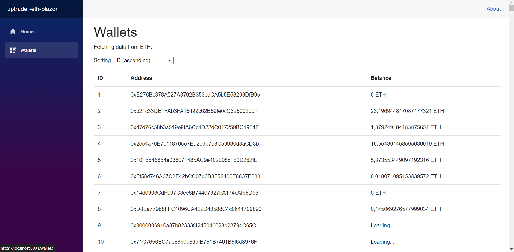

# uptrader-eth-blazor 

Blazor project that includes the page `Wallets`. 

On the page `Wallets` there is table with columns: `Id`, `Address`, `Balance` (data could be sorted by balance).  

## Technical requirements 

- `Netehereum.Web3` should be used; 
- The page should work fast; 
- Balance is not stored in the database, and they could be retrieved from ETH node; 
- ETH testnet Sepolia ([alchemy](https://www.alchemy.com/) и [infura](https://www.infura.io/) are recomended); 
- Communication with the node should be implemented as a separate API service.  

### Additional requirements 

- PostgreSQL; 
- Entity Framework Core. 

## Database entities 

To store information about the wallet in the database, `Wallet` class is implemented as follows: 

```C#
using System.ComponentModel.DataAnnotations.Schema;
using Microsoft.EntityFrameworkCore;

namespace UptraderEthBlazor.Data
{
    /// <summary>
    /// Class that is mapped against database table which contains info about wallets
    /// </summary>
    [Table("Wallets")]
    public class Wallet
    {
        /// <summary>
        /// ID of the wallet in the database
        /// </summary>
        public int? Id { get; set; }
        
        /// <summary>
        /// Address of the wallet 
        /// </summary>
        public string Address { get; set; }
    }
}
```

Note that this class is mapped against the database using `Entity Framework` and doesn't incudes all the field related to the wallet (because of the issue of compatibility between entities in the code and database). 

Therefore there's a necessity to implement another class with the same name, but in the another namespace, which could be accessible in different modules of the project: 

```C#
namespace UptraderEth.Common.Models 
{
    /// <summary>
    /// General representation of a wallet in the application (it is necessary because a wallet entity is
    /// represented in the DB a little bit differently)
    /// </summary>
    public class Wallet
    {
        /// <summary>
        /// ID of the wallet in the database 
        /// </summary>
        public int? Id { get; set; }
        
        /// <summary>
        /// Address of the wallet 
        /// </summary>
        public string Address { get; set; }

        /// <summary>
        /// Balance of the wallet 
        /// </summary>
        public string Balance { get; set; }
    }
}
```

## How to configure and run the application 

1. PostgreSQL database 

In order to initialize the database, copy all the content of `initdb/wallets.sql` file and execute it in PSQL or PgAdmin.

2. API server

There's a `appsettings.json` file inside the folder of API server `apiserver` project. 
The file contains configurational settings for the API server, for example: 

```JSON 
{
    "EthApiServerSettings": {
        "ServerAddress": "http://127.0.0.1:8080/ethapiserver/",
        "Environment": "test",
        "UseEthConnection": false,
        "EthConnectionAddress": "https://mainnet.infura.io/v3/YOUR-API-KEY",
        "HttpPathsDbg": [
            "/dbg/", 
            "/test/"
        ], 
        "PrintWebPaths": false, 
        "PrintHttpRequestProcInfo": true
    }
}
```

Read [infura getting started docs](https://docs.infura.io/infura/getting-started) to find out how you can get `YOUR-API-KEY`. 

Class `Configurator`, that allows us to read data from JSON file, is located in the `common` module, since there is a possibility that config files could be used in other modules of the project as well. 

According to the idea that `common` module is the module, that other modules depend on, you have to implement class for storing the API server setting in the scope of the `common` module (see `UptraderEth.Common.Models.EthApiServerSettings` class). 

3. Running the application 

First of all, you need to start the API server. 
In order to do so, run the following command in CMD: 
```
runapiserver.cmd
```

Then start the Blazor application by running the following command: 
```
runblazor.cmd
```

## Communication with API server 

Functionality of API server: 

- Gets JSON as a request in a form (class `UptraderEth.Common.Models.EthApiOperation` allows to encode the request): 
```JSON
{
    "AppUid": "appuid632rbAbB325ao234", 
    "MethodName": "getbalance", 
    "WalletAddress": "0xE276Bc378A527A8792B353cdCA5b5E53263DfB9e"
}
```

- Sends requests to ETH, or imitates it 

- Returns JSON as a response in a form: 
```JSON
{
    "AppUid": "appuid632rbAbB325ao234", 
    "MethodName": "getbalance", 
    "WalletAddress": "0xE276Bc378A527A8792B353cdCA5b5E53263DfB9e", 
    "WalletBalance": "0.36452", 
    "Status": "SUCCESS"
}
```

It means that the API server could process only one wallet address at a time. 

## Deployment 

### IIS 

In order to deploy ASP.NET Blazor application on IIS, you need to take the following steps: 
- Enable IIS using Control Panel; 
- Download the .NET Core Hosting Bundle: click [here](https://dotnet.microsoft.com/en-us/download/dotnet), choose your version of dotnet and download **ASP.NET Core Runtime - Windows Hosting Bundle Installer**; 
- Build the blazor server using this command: 
```
dotnet build && dotnet publish -c Release
```
- In *IIS Manager*, create new website, set port `8081` and run the website. 

## Secreenshots 



## How the project could be improved 

- You can send an array of wallets, containing such fields as `Address` and `Balance`, to reduce number of requests to the server; 
- In methods for processing HTTP requests inside `UptraderEth.EthApiServer.EthApiHttpServer` class, use `AppUid` and `MethodName` parameters (also check `null` parameters); 
- Deploy API server. 
