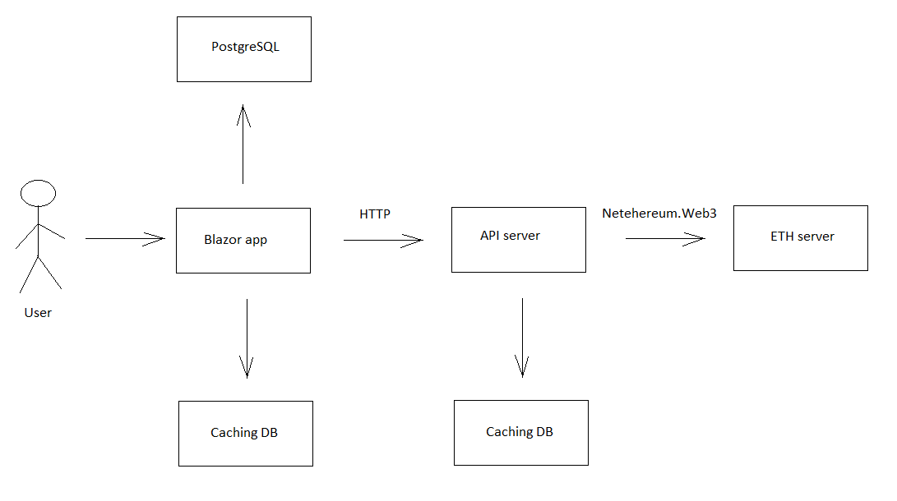

# uptrader-eth-blazor 

[English](README.md) | [Русский](README.ru.md)

This project is a Blazor web application that allows users to view Ethereum wallet information and retrieve real-time balance data from an ETH node using Netehereum.Web3. 
The communication with the ETH node is implemented as a separate API service for optimized performance.

## Overall description 

The project includes the page `Wallets`. 

On the page `Wallets` there is table with columns: `Id`, `Address`, `Balance` (data could be sorted by balance).  

### Goal

The goal of the project is to create a Blazor web application that allows users to view and manage Ethereum wallets, retrieving real-time balance information from an ETH node.

### Scope 

The scope of the project includes designing and implementing the Wallets page with a table for viewing wallet information, integrating with Netehereum.Web3 for retrieving balance data, optimizing the page for fast performance, and creating a separate API service for communication with the ETH node.

### Who can use this project

This project can be used by individuals who want to manage their Ethereum wallets and track their balances, as well as developers who want to learn about integrating Blazor with Ethereum.

### Possible limitations

Possible limitations of this project could include potential challenges in optimizing the page for fast performance, issues with retrieving balance data from the ETH node, and the need for thorough testing to ensure accurate and reliable communication with the ETH node.

## Technical requirements 

- `Netehereum.Web3` should be used; 
- The page should work fast; 
- Balance is not stored in the database, and they could be retrieved from ETH node; 
- ETH testnet Sepolia ([alchemy](https://www.alchemy.com/) and [infura](https://www.infura.io/) are recomended); 
- Communication with the node should be implemented as a separate API service.  

### Additional requirements 

- PostgreSQL; 
- Entity Framework Core. 

## Brief description of the architecture 

The application is supposed to work as follows: 



Note: Blazor app and API server should be deployed separately. 

## Database entities 

To store information about the wallet in the database, `Wallet` class is implemented as follows: 

```C#
using System.ComponentModel.DataAnnotations.Schema;
using Microsoft.EntityFrameworkCore;

namespace UptraderEthBlazor.Data
{
    /// <summary>
    /// Class that is mapped against database table which contains info about wallets
    /// </summary>
    [Table("Wallets")]
    public class Wallet
    {
        /// <summary>
        /// ID of the wallet in the database
        /// </summary>
        public int? Id { get; set; }
        
        /// <summary>
        /// Address of the wallet 
        /// </summary>
        public string Address { get; set; }
    }
}
```

Note that this class is mapped against the database using `Entity Framework` and, according to the technical requirements, doesn't incudes all the field related to the wallet (because of the issue of compatibility between entities in the code and database). 

Therefore there's a necessity to implement another class with the same name, but in the another namespace, which could be accessible in different modules of the project (so it defined in `UptraderEth.Common.Models` namespace): 

```C#
namespace UptraderEth.Common.Models 
{
    /// <summary>
    /// General representation of a wallet in the application (it is necessary because a wallet entity is
    /// represented in the DB a little bit differently)
    /// </summary>
    public class Wallet
    {
        /// <summary>
        /// ID of the wallet in the database 
        /// </summary>
        public int? Id { get; set; }
        
        /// <summary>
        /// Address of the wallet 
        /// </summary>
        public string Address { get; set; }

        /// <summary>
        /// Balance of the wallet 
        /// </summary>
        public string Balance { get; set; }
    }
}
```

## How to configure and run the application 

1. Restore the projects

In order to restore the projects, use the `restore.cmd` file. 

2. PostgreSQL database 
    - Start PostgreSQL server. 
    - Initialize the database: copy all the content of `initdb/wallets.sql` file and execute it in PSQL or PgAdmin.

3. API server

There's `appsettings.json` file inside `apiserver` folder, in which the API server project is located. 
The file contains configurational settings for the API server, for example: 

```JSON 
{
    "EthApiServerSettings": {
        "ServerAddress": "http://127.0.0.1:8080/ethapiserver/",
        "Environment": "production",
        
        "UseEthConnection": false,
        "EthConnectionAddress": "https://mainnet.infura.io/v3/YOUR-API-KEY",

        "HttpPathsDbg": [
            "/dbg/", 
            "/test/"
        ], 
        "PrintWebPaths": false, 
        "PrintHttpRequestProcInfo": true,

        "UseCaching": true, 
        "CachingStorageTime": {
            "Days": 0,
            "Hours": 0, 
            "Minutes": 15
        }
    }
}

```

Read [infura getting started docs](https://docs.infura.io/infura/getting-started) to find out how you can get `YOUR-API-KEY`. 

If you don't have `YOUR-API-KEY` or you don't want to use it, just set `UseEthConnection` to `false` (inside `appsettings.json` file). 
It'll allow you to imitate node server. 

Class `Configurator`, that allows us to read data from JSON file, is located in the `common` module (since there is a possibility that config files could be used in other modules of the project as well). 

According to the idea that `common` module is the module, that other modules depend on, you have to implement class for storing the API server setting in the scope of the `common` module (see `UptraderEth.Common.Models.EthApiServerSettings` class). 

4. Blazor app

Edit `appsettings.json` the following way: 

```JSON 
{
  "Logging": {
    "LogLevel": {
      "Default": "Information",
      "Microsoft": "Warning",
      "Microsoft.Hosting.Lifetime": "Information"
    }
  },
  "AllowedHosts": "*", 

  "AppSettings": {
    "AppUid": "appuid632rbAbB325ao234",
    "ApiServerAddress": "http://127.0.0.1:8080/ethapiserver/p/", 

    "UsePlaceholders": false,

    "UseCaching": true, 
    "CachingStorageTime": {
      "Days": 0,
      "Hours": 0, 
      "Minutes": 15
    }
  }
}
```

Paramer `UsePlaceholders` allows to use [Bootstrap placeholders](https://getbootstrap.com/docs/5.3/components/placeholders/) for displaying data that is not loaded yet. 

5. Running the application 

First of all, you need to start the API server (run the following command in CMD): 

```
runapiserver.cmd
```

Then start the Blazor application by running the following command: 
```
runblazor.cmd
```

## Communication with API server 

Functionality of API server: 

- Gets JSON as a request in the following form (class `UptraderEth.Common.Models.EthApiOperation` allows to encode the request): 

```JSON
{
    "AppUid": "appuid632rbAbB325ao234", 
    "MethodName": "getbalance", 
    "WalletAddress": "0xE276Bc378A527A8792B353cdCA5b5E53263DfB9e"
}
```

- Establishes communication with the ETH node and sends requests to it, or at least imitates the communication; 

- Returns JSON as a response in the following form: 

```JSON
{
    "AppUid": "appuid632rbAbB325ao234", 
    "MethodName": "getbalance", 
    "WalletAddress": "0xE276Bc378A527A8792B353cdCA5b5E53263DfB9e", 
    "WalletBalance": "0.36452", 
    "Status": "SUCCESS"
}
```

The JSON requests and responses, presented above, show that the API server could process only one wallet address at a time. 

## Deployment 

### IIS 

In order to deploy ASP.NET Blazor application on IIS, you need to take the following steps: 

- Enable IIS using Control Panel; 
- Download the .NET Core Hosting Bundle: [click here](https://dotnet.microsoft.com/en-us/download/dotnet), choose your version of dotnet and download **ASP.NET Core Runtime - Windows Hosting Bundle Installer**; 
- Build the blazor server using this command: 
```
dotnet build && dotnet publish -c Release
```
- Edit `web.config` file: 
```xml
<?xml version="1.0" encoding="utf-8"?>
<configuration>
  <location path="." inheritInChildApplications="false">
    <system.webServer>
      <handlers>
        <add name="aspNetCore" path="*" verb="*" modules="AspNetCoreModuleV2" resourceType="Unspecified" />
      </handlers>
      <aspNetCore processPath="dotnet" arguments=".\UptraderEthBlazor.dll" stdoutLogEnabled="false" stdoutLogFile=".\logs\stdout" hostingModel="inprocess" >
        <environmentVariables>
          <environmentVariable name="ASPNETCORE_ENVIRONMENT" value="Development" />
        </environmentVariables>
      </aspNetCore>
    </system.webServer>
  </location>
</configuration>
```
- In *IIS Manager*, create new website, set port `8081` and run the website (make sure that your API server is not using the same port that Blazor app is using). 

## Secreenshots 


## How to contribute 

- [How the project could be improved](docs/TODO.md) 
