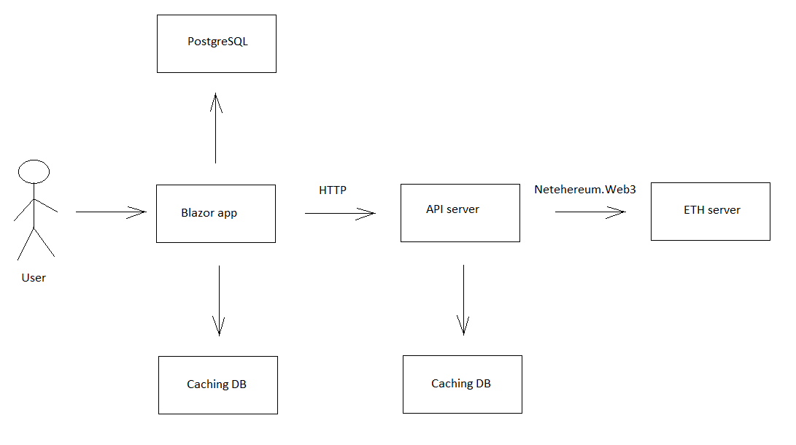

# uptrader-eth-blazor 

[English](README.md) | [Русский](README.ru.md)

Этот проект представляет собой веб-приложение Blazor, которое позволяет пользователям просматривать информацию о кошельке Ethereum и получать данные о балансе в реальном времени с узла ETH с помощью Netehereum.Web3.
Связь с узлом ETH реализована как отдельный сервис API для оптимизации производительности.

## Общее описание

Проект включает в себя страницу `Wallets`.

Blazor-проект, который отображает страницу `Wallets` со списком кошельков. 

На странице `Wallets` находится таблица с колонками `Id`, `Address`, `Balance` (данные в таблице могут быть сортированы по балансу). 

### Цель

Цель проекта — создать веб-приложение Blazor, которое позволит пользователям просматривать и управлять кошельками Ethereum, получая информацию о балансе в реальном времени с узла ETH.

### Область применения

В область применения проекта входит разработка и реализация страницы «Кошельки» с таблицей для просмотра информации о кошельке, интеграция с Netehereum.Web3 для получения данных о балансе, оптимизация страницы для быстрой производительности и создание отдельного API-сервиса для связи с узлом ETH.

### Кто может использовать этот проект

Этот проект могут использовать люди, которые хотят управлять своими кошельками Ethereum и отслеживать свои балансы, а также разработчики, которые хотят узнать об интеграции Blazor с Ethereum.

### Возможные ограничения

Возможные ограничения этого проекта могут включать потенциальные проблемы с оптимизацией страницы для обеспечения высокой производительности, проблемы с получением данных о балансе из узла ETH, а также необходимость тщательного тестирования для обеспечения точной и надежной связи с узлом ETH.

## Технические требования

- Использование `Netehereum.Web3`; 
- Страница `Wallets` должна работать и подгружаться быстро; 
- Баланс не должен храниться в БД, поскольку его необходимо получать при общении с ETH нодой; 
- Рекомендуется использование ETH testnet Sepolia ([alchemy](https://www.alchemy.com/) и [infura](https://www.infura.io/)); 
- Коммуникация с ETH нодой реализовано в качестве отдельного API сервиса. 

### Дополнительные требования  

- PostgreSQL; 
- Entity Framework Core. 

## Краткое описание архитектуры

Ниже представлена предварительная схема использования приложения: 



Замечание: клиентское приложение на Blazor и API сервиса дожны быть развернуты отдельно друг от друга. 

## Сущности в БД 

Для целей хранения информации о кошельке в БД используется класс `Wallet` (его определение представлено ниже).

```C#
using System.ComponentModel.DataAnnotations.Schema;
using Microsoft.EntityFrameworkCore;

namespace UptraderEthBlazor.Data
{
    /// <summary>
    /// Class that is mapped against database table which contains info about wallets
    /// </summary>
    [Table("Wallets")]
    public class Wallet
    {
        /// <summary>
        /// ID of the wallet in the database
        /// </summary>
        public int? Id { get; set; }
        
        /// <summary>
        /// Address of the wallet 
        /// </summary>
        public string Address { get; set; }
    }
}
```

Обратите внимание, что данный класс завязан на БД с использованием `Entity Framework` и, следуя техническим требованиям, не включает все поля, относящиеся к кошелькам (по причине проблемы совместимости между сущностями в коде и БД). 

Исходя из этого, существует необходимость в реализации другого класса с идентичным наименованием, но в другом неймспейсе, который также мог бы быть доступным для использования из разных модулей данного проекта (поэтому он и определен в неймспейсе `UptraderEth.Common.Models`): 

```C#
namespace UptraderEth.Common.Models 
{
    /// <summary>
    /// General representation of a wallet in the application (it is necessary because a wallet entity is
    /// represented in the DB a little bit differently)
    /// </summary>
    public class Wallet
    {
        /// <summary>
        /// ID of the wallet in the database 
        /// </summary>
        public int? Id { get; set; }
        
        /// <summary>
        /// Address of the wallet 
        /// </summary>
        public string Address { get; set; }

        /// <summary>
        /// Balance of the wallet 
        /// </summary>
        public string Balance { get; set; }
    }
}
```

## Как сконфигурировать и запустить приложение 

1. Восстановить проекты 

Для восстановления проектов используйте файл `restore.cmd`.

2. База данных PostgreSQL 

    - Запустить PostgreSQL server. 
    - Инициализровать БД: скопировать содержимое файла `initdb/wallets.sql` и выполнить в PSQL или PgAdmin.

3. API сервер

Обратите внимание на файл `appsettings.json`, которые находится в папке `apiserver`, в которой находится проект для API сервера. 
Данный файл содержит конфигурационные настройки для API сервера, например:

```JSON 
{
    "EthApiServerSettings": {
        "ServerAddress": "http://127.0.0.1:8080/ethapiserver/",
        "Environment": "production",
        
        "UseEthConnection": false,
        "EthConnectionAddress": "https://mainnet.infura.io/v3/YOUR-API-KEY",

        "HttpPathsDbg": [
            "/dbg/", 
            "/test/"
        ], 
        "PrintWebPaths": false, 
        "PrintHttpRequestProcInfo": true,

        "UseCaching": true, 
        "CachingStorageTime": {
            "Days": 0,
            "Hours": 0, 
            "Minutes": 15
        }
    }
}

```

Советуем прочитать [infura getting started docs](https://docs.infura.io/infura/getting-started) для понимания того, как можно получить `YOUR-API-KEY`. 

Если у вас нет `YOUR-API-KEY`, или вы не хотите его использовать, можно поставить параметр `UseEthConnection` равным `false` (в файле `appsettings.json`). 
Это позволит имитировать поведение ETH ноды. 

Класс `Configurator`, который позволяет читать данные из JSON файла, находится в модуле `common` (поскольку существует вероятность того, что в других модуля может потребоваться использование конфигурационных файлов). 

Согласно идее того, что от модуля `common` зависят другие модули данного приложения, необходимо реализовать класс для хранения настроек API сервера внутри модуля `common` (например, класс `UptraderEth.Common.Models.EthApiServerSettings`). 

4. Приложение Blazor 

Отредактируйте `appsettings.json` следующим образом: 

```JSON 
{
  "Logging": {
    "LogLevel": {
      "Default": "Information",
      "Microsoft": "Warning",
      "Microsoft.Hosting.Lifetime": "Information"
    }
  },
  "AllowedHosts": "*", 

  "AppSettings": {
    "AppUid": "appuid632rbAbB325ao234",
    "ApiServerAddress": "http://127.0.0.1:8080/ethapiserver/p/", 

    "UsePlaceholders": false,

    "UseCaching": true, 
    "CachingStorageTime": {
      "Days": 0,
      "Hours": 0, 
      "Minutes": 15
    }
  }
}
```

Параметр `UsePlaceholders` позволяет использовать [Bootstrap placeholders](https://getbootstrap.com/docs/5.3/components/placeholders/) для данных, которые ещё не были загружены с сервера. 

5. Запуск приложения 

Сначала, необходимо запустить API сервер: 

```
runapiserver.cmd
```

Затем запустите Blazor-приложение:

```
runblazor.cmd
```

## Коммуникация с API сервером

Функциональность API сервера: 

- Получение JSON запроса в следующем виде (класс `UptraderEth.Common.Models.EthApiOperation` позволяет кодировать/декодировать запросы): 

```JSON
{
    "AppUid": "appuid632rbAbB325ao234", 
    "MethodName": "getbalance", 
    "WalletAddress": "0xE276Bc378A527A8792B353cdCA5b5E53263DfB9e"
}
```

- Устанавливает коммуникацию с ETH нодой и отправляет запросы к ней (или, как минимум, имитирует такого рода коммуникацию);   

- Отправляет JSON ответа в следующем виде: 

```JSON
{
    "AppUid": "appuid632rbAbB325ao234", 
    "MethodName": "getbalance", 
    "WalletAddress": "0xE276Bc378A527A8792B353cdCA5b5E53263DfB9e", 
    "WalletBalance": "0.36452", 
    "Status": "SUCCESS"
}
```

Из формы представленных выше запросов и ответов видно, что API сервер может обрабатывать только один адрес кошелька в единицу времени.

## Развертывание

### IIS 

Для развертывания ASP.NET Blazor приложения на IIS, необходимо выполнить следующие шаги: 

- Активировать IIS с использованием Панели управления; 
- Загрузить .NET Core Hosting Bundle: [кликните здесь](https://dotnet.microsoft.com/en-us/download/dotnet), выберете вшу версию dotnet и загрузите **ASP.NET Core Runtime - Windows Hosting Bundle Installer**; 
- Скомпилируйте проект: 
```
dotnet build && dotnet publish -c Release
```
- Отредактируйте `web.config`: 
```xml
<?xml version="1.0" encoding="utf-8"?>
<configuration>
  <location path="." inheritInChildApplications="false">
    <system.webServer>
      <handlers>
        <add name="aspNetCore" path="*" verb="*" modules="AspNetCoreModuleV2" resourceType="Unspecified" />
      </handlers>
      <aspNetCore processPath="dotnet" arguments=".\UptraderEthBlazor.dll" stdoutLogEnabled="false" stdoutLogFile=".\logs\stdout" hostingModel="inprocess" >
        <environmentVariables>
          <environmentVariable name="ASPNETCORE_ENVIRONMENT" value="Development" />
        </environmentVariables>
      </aspNetCore>
    </system.webServer>
  </location>
</configuration>
```
- В *IIS Manager* создайте новый вэбсайт, поставьте порт `8081` и запутстите вэбсайт (важно, чтобы API сервер не использовал тот же самый порт, что и Blazor приложение). 

## Скриншоты


## Как контрибьютить

- [Как проект может быть улучшен](docs/TODO.md) 